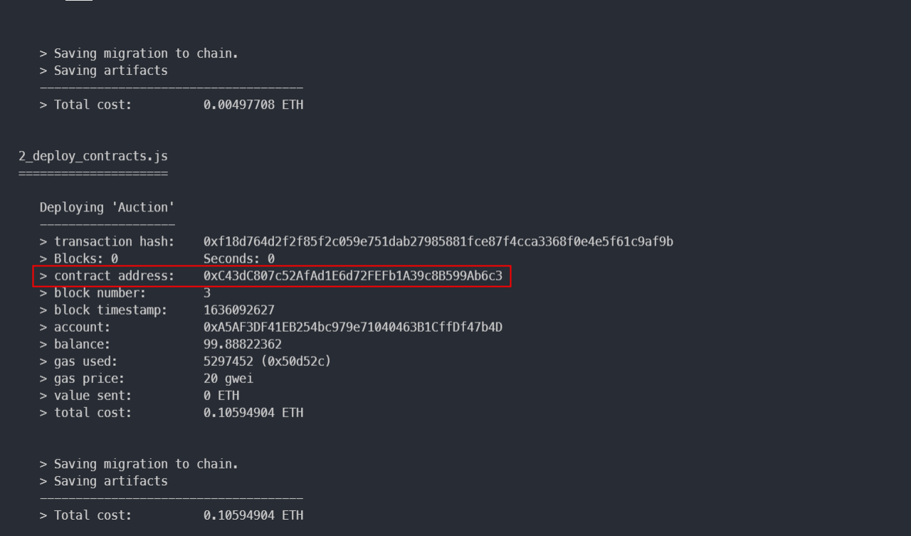

# CZ's Auction Dapp for NFT
An Auction Dapp on ethereum for NFT

- [CZ's Auction Dapp for NFT](#czs-auction-dapp-for-nft)
  - [Pre-installed (You **must** first Download the followin dependencies)](#pre-installed-you-must-first-download-the-followin-dependencies)
  - [How to Run](#how-to-run)
  - [Built With](#built-with)
  - [Project Display](#project-display)

## Pre-installed (You **must** first Download the followin dependencies)
- Node v16.13.0
- Npm v8.1.0
- IPFS v0.10.0
- Truffle v5.4.16 (core: 5.4.16)
- Solidity - 0.8.9 (solc-js)
- Web3.js v1.5.3

## How to Run
> Take the following instructions in order
1. clone the repository
```bash
git clone https://github.com/Chan-ZJU/Auction-Dapp.git
(or git clone git@github.com:Chan-ZJU/Auction-Dapp.git)
```

2. Then start ganache to run a local net (make sure the port num is 8545)


3. Then open a new terminal start IPFS, run the following script:
```bash
ipfs config --json API.HTTPHeaders.Access-Control-Allow-Origin '[\"*\"]'
ipfs config --json API.HTTPHeaders.Access-Control-Allow-Methods '[\"PUT\", \"GET\", \"POST\"]'
ipfs daemon
```
4. run npm install to install the dependencies
```bash
npm install
```

5. Then deploy the contract on your local net (ganache)
```bash
truffle deploy --reset
```

6. After deploy by truffle:

copy the contract address and paste it to `'Auction-Dapp/src/eth/auction.js'`:


7. link truffle projects to your ganache local network:

Click `ADD PROJECT`, choose `Auction-Dapp/truffle-config.js`

Then click `Save and Restart`

the result is like this:


8. Finally run the project
```bash
npm start
```

## Built With
- Nodejs
- Solidity
- Web3.js
- React
- AntDesign
- Truffle
- Ganache
  
## Project Display
- Mint NFT 

- See my NFT and create auction

- Auto detect Account change without reloading the page

- See my auctioned NFT

- See NFT market

- Trace NFT history oweners

- See my bought NFT
